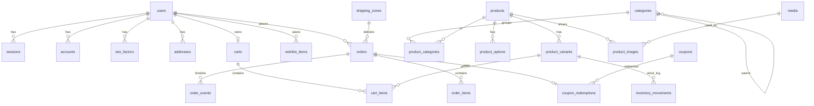

# قاعدة البيانات (PostgreSQL)

> المخطط في `src/server/db/schema/*` — الترحيلات (SQL) في `drizzle/` — **لا تعدّل جدولاً يدوياً في الإنتاج**،
> عدّل المخطط ثم شغّل `pnpm db:generate` وراجع ملف SQL الناتج، ثم `pnpm db:migrate`.

## المبادئ

| المبدأ                     | التطبيق                                                                                                                                         |
| -------------------------- | ----------------------------------------------------------------------------------------------------------------------------------------------- |
| المال أعداد صحيحة          | كل المبالغ `bigint` بأصغر وحدة للعملة (فلس/هللة) — لا أخطاء تقريب.                                                                              |
| القاعدة تحمي نفسها         | قيود `CHECK` تمنع المخزون السالب، السعر السالب، سعر "قبل الخصم" الأقل من السعر، الأدوار غير المعروفة، البريد بأحرف كبيرة، الكوبون بنسبة > 100%. |
| لقطات (Snapshots) للطلبات  | الطلب يحفظ نسخة من الاسم والعنوان والسعر لحظة الشراء؛ تعديل المنتج لاحقاً لا يغيّر الطلبات القديمة.                                             |
| لا معرّفات متسلسلة للوصول  | رابط "عرض الطلب" للزائر يستخدم رمزاً عشوائياً يُخزَّن مشفّراً (SHA-256)، ورقم الطلب (#10001) للعرض فقط.                                         |
| منع الطلب المكرر           | `orders.idempotency_key` فريد — الضغط مرتين على "تأكيد الطلب" لا يُنشئ طلبين.                                                                   |
| سجل تدقيق غير قابل للتلاعب | Trigger يمنع تعديل/حذف `audit_logs` إلا لمهمة الأرشفة الصريحة.                                                                                  |
| محتوى متعدد اللغات         | الحقول النصية `jsonb` بالشكل `{ ar, en }` مع رجوع تلقائي للغة المتوفرة.                                                                         |
| بحث يفهم العربية           | `products.search_text` نص موحّد (همزات/تاء مربوطة/أرقام هندية) + فهرس `pg_trgm`.                                                                |

## الجداول (30)



| المجموعة         | الجداول                                                                                                          | الوصف                                                                                                      |
| ---------------- | ---------------------------------------------------------------------------------------------------------------- | ---------------------------------------------------------------------------------------------------------- |
| الهوية والمصادقة | `users`, `sessions`, `accounts`, `verifications`, `two_factors`, `auth_rate_limits`                              | جداول Better Auth. الدور (`role`): customer / order_manager / catalog_manager / admin / owner.             |
| الكتالوج         | `categories`, `products`, `product_categories`, `product_options`, `product_variants`, `product_images`, `media` | كل منتج له نسخة (Variant) واحدة على الأقل تحمل السعر والمخزون. الخيارات (مقاس/لون) بقيم ذات معرّفات ثابتة. |
| المخزون          | `inventory_movements`                                                                                            | كل تغيّر في الكمية مع سببه (طلب، إلغاء، تعديل يدوي...).                                                    |
| الزبائن          | `addresses`, `wishlist_items`                                                                                    | عنوان افتراضي واحد لكل زبون (فهرس فريد جزئي).                                                              |
| السلة            | `carts`, `cart_items`                                                                                            | سلة على الخادم؛ المتصفح يحمل رمزاً عشوائياً فقط. سلة واحدة لكل مستخدم مسجّل.                               |
| الطلبات          | `orders`, `order_items`, `order_events`, `coupons`, `coupon_redemptions`, `shipping_zones`                       | دورة الطلب: pending → confirmed → processing → shipped → delivered (أو cancelled / returned).              |
| المحتوى          | `settings`, `pages`, `home_sections`                                                                             | الإعدادات (JSON مُتحقق منه لكل قسم)، الصفحات الثابتة، أقسام الصفحة الرئيسية المرتبة.                       |
| النظام           | `audit_logs`, `rate_limit_buckets`, `outbox_messages`                                                            | سجل التدقيق، عدّادات تحديد المعدل، صندوق الإشعارات الصادرة مع إعادة المحاولة.                              |

## الأوامر

```bash
pnpm db:migrate          # تطبيق الترحيلات
pnpm db:seed             # بيانات أساسية لمتجر جديد (إعدادات، مناطق، صفحات، تخطيط الرئيسية)
pnpm db:seed:demo        # + كتالوج تجريبي بصور مولّدة
pnpm db:seed -- --country=SA   # دولة أخرى عند الإنشاء: IQ SA AE KW QA BH OM JO EG
pnpm db:studio           # متصفح بيانات (Drizzle Studio)
```

## النسخ الاحتياطي (إلزامي في الإنتاج)

```bash
pg_dump --format=custom --file=backup-$(date +%F).dump "$DATABASE_URL"
pg_restore --clean --if-exists --dbname="$DATABASE_URL" backup-YYYY-MM-DD.dump
```

احفظ نسخة يومية خارج الخادم، واختبر الاستعادة دورياً. (يُؤتمت في المرحلة 7.)
